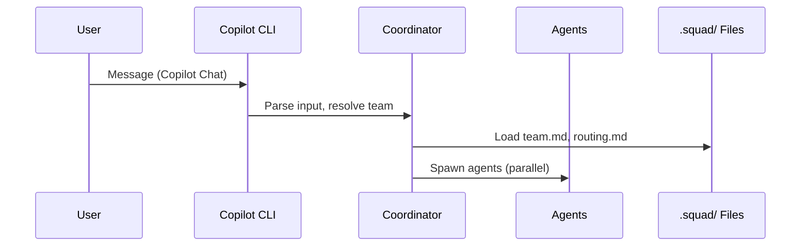
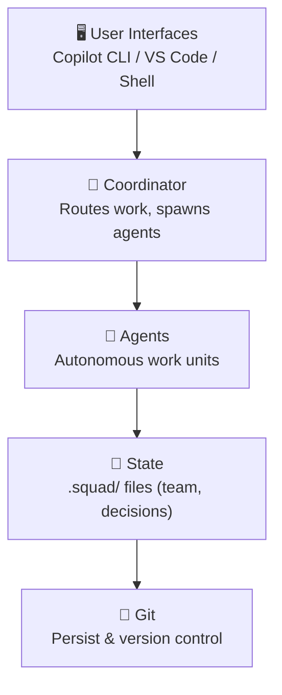

# CI: Mermaid → PNG Rendering Proposal

**Requested by:** Dina  
**Date:** 2026-03-25  
**Status:** Research & Proposal  

---

## Executive Summary

Squad docs already contain inline Mermaid diagrams (e.g., `architecture.md`, `parallel-work.md`) embedded as code blocks in markdown. Currently, these render **dynamically in the browser** via JavaScript. This proposal evaluates three approaches to **pre-render Mermaid diagrams to PNG** at build time, reducing rendering load and improving site performance.

**Recommendation:** **Option A + B Hybrid** — npm script hook (`prebuild`) with GitHub Actions fallback.

---

## Current State

### Existing Mermaid Usage
- **Location:** Inline mermaid code blocks in `.md` files
- **Examples:** 
  - `docs/src/content/docs/concepts/architecture.md` — sequenceDiagram (user flow), graph (component stack)
  - `docs/src/content/docs/concepts/parallel-work.md` — graph (fan-out execution)
  - `docs/src/content/docs/concepts/memory-and-knowledge.md` — mermaid blocks
  - `docs/src/content/docs/concepts/your-team.md` — mermaid blocks
- **Current rendering:** Astro outputs mermaid code blocks as-is; client-side JavaScript (mermaid.js library) renders them in the browser
- **Build process:** `docs/package.json` runs `"build": "astro build && npx pagefind --site dist"`
- **Astro config:** `docs/astro.config.mjs` currently has no mermaid integration; uses remark/rehype plugins for links and pagefind attributes

### Observations
- No `.mmd` source files exist — all diagrams are inline
- No Mermaid-specific tooling in the docs pipeline yet
- Astro has no built-in Mermaid renderer; integration requires custom plugin or pre-build script
- GitHub Actions workflow (`.github/workflows/squad-docs.yml`) is simple: checkout → install → build → deploy

---

## Tool Analysis: `@mermaid-js/mermaid-cli` (mmdc)

### What is mmdc?
Official CLI for Mermaid rendering. Converts `.mmd` files or inline Mermaid syntax to PNG/SVG.

### Installation & Usage
```bash
# Install
npm install --save-dev @mermaid-js/mermaid-cli

# Render a .mmd file to PNG
mmdc -i diagram.mmd -o diagram.png

# Render with theme
mmdc -i diagram.mmd -o diagram.png --theme dark
```

### Pros
- Official, well-maintained tool
- No custom code needed for rendering
- Supports themes (light/dark), output formats (PNG/SVG), scaling
- Cross-platform (Windows, macOS, Linux)

### Cons
- Requires Puppeteer (headless Chrome) — adds ~100MB to CI, slows initial build
- Heavy for lightweight diagrams
- No real-time preview without running locally

### Alternatives Considered
- **mermaid.js direct (Node.js API):** Lighter, but less stable; limited CLI support
- **Kroki:** Cloud-based diagram rendering (generic, not mermaid-specific; adds external dependency)
- **Hand-drawn SVGs:** No automation; doesn't scale

**Verdict:** mmdc is the standard for Mermaid pre-rendering. Trade-offs are acceptable.

---

## Three Approaches Evaluated

### Option A: Pre-build Step in GitHub Actions (CI-Only)

**Approach:**
1. Add a GitHub Actions step before `npm run build` in `.github/workflows/squad-docs.yml`
2. Use mmdc to scan for mermaid blocks or `.mmd` files
3. Generate PNGs to `docs/src/content/docs/*/images/`
4. Markdown references diagrams as `` instead of code blocks

**Implementation (YAML snippet):**
```yaml
- name: Install Mermaid CLI
  working-directory: docs
  run: npm install --save-dev @mermaid-js/mermaid-cli puppeteer

- name: Render Mermaid diagrams
  working-directory: docs
  run: |
    node scripts/render-mermaid.js
    # Scans src/content/docs/**/*.md, extracts mermaid blocks, 
    # renders to src/content/docs/*/images/*.png
```

**Pros:**
- ✅ PNGs generated fresh every CI build, never stale
- ✅ No local tooling burden on developers
- ✅ Minimal docs/package.json changes
- ✅ Reduces client-side rendering work

**Cons:**
- ❌ Developers cannot preview diagrams locally (`npm run dev` sees raw code blocks)
- ❌ Requires ~1-2min extra CI time for Puppeteer + rendering
- ❌ Script must extract mermaid from markdown (requires regex/AST parsing)
- ❌ No real-time feedback during authoring

**Timeline:** ~3 min (Puppeteer download + rendering)  
**Local DX:** Poor — authors can't preview locally

---

### Option B: npm Script Hook (Local + CI)

**Approach:**
1. Add `"prebuild": "node scripts/render-mermaid.js"` to `docs/package.json`
2. Script discovers `.mmd` files in `docs/src/content/docs/diagrams/`
3. Renders to `docs/src/content/docs/*/images/` (sibling or nearby directory)
4. Markdown references: ``
5. Run `npm ci && npm run build` locally or in CI → prebuild runs automatically

**Implementation (package.json):**
```json
{
  "scripts": {
    "prebuild": "node scripts/render-mermaid.js",
    "build": "astro build && npx pagefind --site dist"
  }
}
```

**Pros:**
- ✅ Works locally AND in CI (single script, reused everywhere)
- ✅ Developers can run `npm run build` locally and see generated PNGs
- ✅ Real-time feedback during authoring
- ✅ Faster CI (no Puppeteer re-download on every run — cached via npm)
- ✅ Simpler workflow: edit `.mmd` → run build → preview

**Cons:**
- ❌ Requires mmdc + Puppeteer locally (developers must install)
- ❌ Adds ~100MB to `node_modules`
- ❌ First build slower if Puppeteer isn't cached
- ❌ `.mmd` files are source — must be committed to repo (PNGs generated or .gitignored)

**Timeline:** ~1-2 min locally (first time); ~30s cached  
**Local DX:** Excellent — live preview, iterate on diagrams

---

### Option C: Astro Integration Plugin

**Approach:**
1. Create custom Astro integration in `docs/src/plugins/astro-mermaid.mjs`
2. Plugin processes mermaid code blocks during Astro's build phase
3. Outputs inline SVG or references PNG
4. No separate npm script; happens transparently during `astro build`

**Implementation sketch:**
```javascript
// docs/src/plugins/astro-mermaid.mjs
export default function astroBuildMermaid() {
  return {
    name: 'astro-mermaid',
    hooks: {
      'astro:build:done': async ({ dir }) => {
        // Scan generated HTML, find mermaid blocks,
        // replace with SVG or img tags
      }
    }
  };
}
```

**Pros:**
- ✅ Cleanest integration — no separate step
- ✅ Transparent to build process
- ✅ Diagrams remain inline or optimized based on strategy

**Cons:**
- ❌ Requires custom JavaScript code (not trivial)
- ❌ Post-processing approach (slower than pre-rendering)
- ❌ Tight coupling to Astro internals (maintenance burden)
- ❌ Debugging is harder if rendering fails mid-build
- ❌ No proven library; custom implementation risk

**Timeline:** ~2-3 min (custom code + rendering)  
**Local DX:** Good but opaque — magic happens inside build

---

## Decision Matrix

| Factor | Option A | Option B | Option C |
|--------|----------|----------|----------|
| **Local preview** | ❌ None | ✅ Excellent | ✅ Good |
| **CI performance** | ⚠️ Slow (DL Puppeteer) | ✅ Fast | ⚠️ Moderate |
| **Developer friction** | ✅ Low (no local install) | ⚠️ Moderate (install mmdc) | ✅ Low |
| **Implementation** | ⚠️ Medium (script + YAML) | ✅ Simple (npm prebuild) | ❌ Complex (Astro plugin) |
| **Maintainability** | ✅ High | ✅ High | ❌ Low |
| **Debuggability** | ✅ Explicit step | ✅ Explicit step | ❌ Hidden in build |
| **Cache support** | ⚠️ No | ✅ Yes | ⚠️ Limited |

---

## Recommendation: **Option B (npm prebuild) + Option A (CI fallback)**

### Why Option B Primary?
- **DX wins:** Developers can author and preview diagrams locally in real-time
- **Reliable:** Same script runs everywhere (local, CI, CI/CD)
- **Speed:** npm cache hits after first run
- **Simplicity:** One script, one command

### Why Add Option A Fallback?
- **Fresh CI builds:** Even if a developer doesn't run prebuild locally, CI always regenerates PNGs
- **Safety net:** Diagrams never stale in deployed site
- **Scalability:** If local develop workflow changes, CI is still safe

### Hybrid Approach (Recommended)

**Step 1: Create prebuild script**
```bash
docs/scripts/render-mermaid.js
```
- Discovers `.mmd` files in `docs/src/content/docs/diagrams/`
- Renders to `docs/src/content/docs/*/images/`
- Handles errors gracefully (warn, don't fail build)

**Step 2: Update docs/package.json**
```json
{
  "scripts": {
    "prebuild": "node scripts/render-mermaid.js",
    "build": "astro build && npx pagefind --site dist"
  },
  "devDependencies": {
    "@mermaid-js/mermaid-cli": "^10.9.0"
  }
}
```

**Step 3: Update .github/workflows/squad-docs.yml**
```yaml
- name: Install docs dependencies
  working-directory: docs
  run: npm ci
  # npx prebuild runs automatically via npm's "pre" hook

- name: Build docs site
  working-directory: docs
  run: npm run build
```

**Step 4: Source file organization**
```
docs/
├── src/
│   └── content/
│       └── docs/
│           ├── concepts/
│           │   ├── architecture.md
│           │   ├── images/
│           │   │   ├── architecture-flow.png (generated)
│           │   │   └── architecture-components.png (generated)
│           │   └── diagrams/
│           │       ├── architecture-flow.mmd (source)
│           │       └── architecture-components.mmd (source)
│           ├── features/
│           └── ...
└── scripts/
    └── render-mermaid.js
```

**Step 5: .gitignore**
```
docs/src/content/docs/**/images/*.png
```

---

## Implementation Details

### Source Format: `.mmd` Files vs Inline

**Recommendation:** `.mmd` source files + markdown references

**Rationale:**
- **Separation of concerns:** Diagram logic separate from narrative
- **Reusability:** One diagram referenced from multiple pages
- **Easier authoring:** No escaping backticks in markdown
- **Version history:** Git diff on `.mmd` files is cleaner than on markdown code blocks

**Markdown usage:**
```markdown
## System Architecture

The system is organized into three layers:


### Components


```

**Alternative (if preferred):** Keep inline mermaid blocks; parsing script extracts + renders them. More work in the script, but no `.mmd` files.

---

## File Organization

### Proposed Structure
```
docs/src/content/docs/
├── concepts/
│   ├── architecture.md
│   ├── diagrams/
│   │   ├── user-flow.mmd
│   │   └── component-stack.mmd
│   └── images/
│       ├── user-flow.png (git-ignored, generated)
│       └── component-stack.png (git-ignored, generated)
├── features/
│   ├── parallel-execution.md
│   ├── diagrams/
│   │   └── fan-out.mmd
│   └── images/
│       └── fan-out.png (generated)
└── ...
```

**Benefits:**
- Source and output live near the content
- Clear separation of input (`.mmd`) and output (`.png`)
- Easy to maintain per-page diagrams
- Generated PNGs are `.gitignore`d (not bloat repo)

---

## Local Development Experience

### For Authors

**Workflow:**
1. Edit or create `.mmd` file in `docs/src/content/docs/{section}/diagrams/`
2. Update markdown to reference the PNG: ``
3. Run `npm run build` from `docs/` directory
4. PNGs are generated to `docs/src/content/docs/{section}/images/`
5. Run `npm run dev` to see site with PNGs rendered
6. Iterate on `.mmd` until satisfied

**Dependencies:** Must run `npm install` once in `docs/` to get mmdc + Puppeteer

**First-time setup (one-time):**
```bash
cd docs
npm install
```

**Then, authoring is seamless:**
```bash
npm run build  # Renders diagrams + builds site
npm run dev    # Preview live
```

---

## GitHub Actions Snippet (Recommended Hybrid)

**File: `.github/workflows/squad-docs.yml`**

```yaml
name: Squad Docs — Build & Deploy

on:
  workflow_dispatch:
  push:
    branches: [main]
    paths:
      - 'docs/**'
      - '.github/workflows/squad-docs.yml'

permissions:
  contents: read
  pages: write
  id-token: write

concurrency:
  group: pages
  cancel-in-progress: true

jobs:
  build:
    runs-on: ubuntu-latest
    steps:
      - uses: actions/checkout@v4

      - uses: actions/setup-node@v4
        with:
          node-version: '22'
          cache: npm
          cache-dependency-path: docs/package-lock.json

      - name: Install docs dependencies
        working-directory: docs
        run: npm ci
        # prebuild hook runs automatically: npm triggers "prebuild" before "build"

      - name: Build docs site
        working-directory: docs
        run: npm run build
        # "build" script runs "prebuild" automatically (npm lifecycle hook),
        # then runs astro build + pagefind

      - name: Upload Pages artifact
        uses: actions/upload-pages-artifact@v3
        with:
          path: docs/dist

  deploy:
    needs: build
    runs-on: ubuntu-latest
    environment:
      name: github-pages
      url: ${{ steps.deployment.outputs.page_url }}
    steps:
      - name: Deploy to GitHub Pages
        id: deployment
        uses: actions/deploy-pages@v4
```

**Key points:**
- ✅ No new GitHub Actions step required
- ✅ npm's built-in `prebuild` hook runs automatically when `npm run build` is called
- ✅ Puppeteer downloads on first CI run, then cached
- ✅ Fresh PNGs on every push to main

---

## Render Script Outline: `docs/scripts/render-mermaid.js`

```javascript
#!/usr/bin/env node

import fs from 'fs/promises';
import path from 'path';
import { execSync } from 'child_process';

const DOCS_ROOT = path.join(process.cwd(), 'src/content/docs');
const MMDC = 'npx @mermaid-js/mermaid-cli';

/**
 * Recursively find all .mmd files in docs/src/content/docs/
 */
async function findMermaidFiles(dir) {
  const files = [];
  const entries = await fs.readdir(dir, { withFileTypes: true });

  for (const entry of entries) {
    const fullPath = path.join(dir, entry.name);
    if (entry.isDirectory()) {
      files.push(...await findMermaidFiles(fullPath));
    } else if (entry.name.endsWith('.mmd')) {
      files.push(fullPath);
    }
  }

  return files;
}

/**
 * Render a single .mmd file to PNG
 */
async function renderDiagram(mmdPath) {
  try {
    // Output PNG to sibling images/ directory
    const dir = path.dirname(mmdPath);
    const filename = path.basename(mmdPath, '.mmd');
    const imageDir = path.join(dir, '..', 'images');
    const pngPath = path.join(imageDir, `${filename}.png`);

    // Ensure images/ directory exists
    await fs.mkdir(imageDir, { recursive: true });

    // Run mmdc
    const cmd = `${MMDC} -i "${mmdPath}" -o "${pngPath}"`;
    execSync(cmd, { stdio: 'inherit' });

    console.log(`✅ Rendered: ${path.relative(DOCS_ROOT, pngPath)}`);
  } catch (err) {
    console.error(`❌ Failed to render ${mmdPath}:`, err.message);
    // Don't fail build; warn and continue
  }
}

/**
 * Main
 */
async function main() {
  console.log('🎨 Rendering Mermaid diagrams...');

  try {
    const mmdFiles = await findMermaidFiles(DOCS_ROOT);

    if (mmdFiles.length === 0) {
      console.log('ℹ️  No .mmd files found.');
      return;
    }

    console.log(`Found ${mmdFiles.length} diagram(s).`);

    for (const mmdPath of mmdFiles) {
      await renderDiagram(mmdPath);
    }

    console.log('✨ Done.');
  } catch (err) {
    console.error('Error:', err);
    process.exit(1);
  }
}

main();
```

---

## PNGs in Git: Commit or .gitignore?

### Recommendation: `.gitignore` PNGs, commit `.mmd` source files

**Rationale:**
- PNGs are generated artifacts, not source
- Source of truth is `.mmd` files
- Reduces repo size and history bloat
- If someone changes a `.mmd` file, CI regenerates fresh PNG
- Team members who clone can rebuild locally (`npm run build`)

**.gitignore entry:**
```
docs/src/content/docs/**/images/*.png
```

**Alternative:** Commit PNGs if:
- You want exact visual parity across all CI/local builds
- PNGs are large and regeneration is slow
- Team doesn't have Puppeteer installed locally

Not recommended for this use case (diagrams are small, regeneration is fast, DX is better with source-only).

---

## Testing & Validation

### What to test in CI/CD

**1. Prebuild script errors don't block build**
```javascript
// render-mermaid.js should warn, not fail
if (mmdFiles.length === 0) {
  console.log('ℹ️  No .mmd files found.');
  return; // exit 0
}
```

**2. All generated PNGs exist**
```bash
# Add to docs/test/ if desired
if [ ! -f "src/content/docs/concepts/images/user-flow.png" ]; then
  echo "ERROR: user-flow.png not generated"
  exit 1
fi
```

**3. Astro build still works after prebuild**
- Existing `npm run test:build` validates Astro output
- No new tests needed if script doesn't change markdown

### Local validation

```bash
# Author runs locally
cd docs
npm install        # First time only
npm run build      # Renders + builds
npm run dev        # Preview with PNGs

# Verify PNGs exist
ls src/content/docs/concepts/images/
```

---

## Rollout Plan

### Phase 1: Implementation (Week 1)
- [ ] Create `docs/scripts/render-mermaid.js`
- [ ] Update `docs/package.json` with `@mermaid-js/mermaid-cli` dependency and `prebuild` script
- [ ] Create `.mmd` source files for existing diagrams (e.g., `architecture.md` → `diagrams/user-flow.mmd`, `diagrams/components.mmd`)
- [ ] Update markdown to reference PNGs
- [ ] Test locally: `npm run build` → PNGs generated ✅
- [ ] Commit `.mmd` files + script; `.gitignore` PNGs

### Phase 2: CI Integration (Week 1)
- [ ] Update `.github/workflows/squad-docs.yml` (no changes needed if prebuild is in package.json)
- [ ] Merge to dev, test CI run
- [ ] Verify PNGs generated in CI artifact
- [ ] Deploy to main

### Phase 3: Documentation (Week 2)
- [ ] Add to docs handbook: "How to create diagrams" (`.mmd` files, prebuild script, preview locally)
- [ ] Link from contribution guidelines

---

## Risks & Mitigations

| Risk | Mitigation |
|------|-----------|
| **Puppeteer fails in CI** | Pre-cache Puppeteer binary in `node_modules` cache; use GitHub Actions service container as fallback |
| **Large diagrams slow build** | Render in parallel; add timeout to mmdc (default ~30s/diagram is fine) |
| **Developers forget to run prebuild locally** | Document in contribution guide; CI always regenerates, so site is safe |
| **PNG filenames don't match references** | Script uses consistent naming: `.mmd` basename → `.png` basename |
| **First CI run is slow** | Expected (~2-3 min); subsequent runs cached. Document in PR/release notes |

---

## Conclusion

**Recommended approach: Option B (npm prebuild) + Option A (CI safety net)**

**Benefits:**
- ✅ Excellent local DX (live preview, iterate on diagrams)
- ✅ Reliable CI (always fresh PNGs)
- ✅ Simple implementation (one script, npm lifecycle hook)
- ✅ Maintainable (explicit, debuggable steps)
- ✅ No GitHub Actions pipeline changes needed

**Next steps:**
1. Approve proposal
2. Implement render script
3. Create `.mmd` source files for existing diagrams
4. Test locally + CI
5. Document for team
6. Deploy to main

---

## Appendix: Example Diagram Files

### `docs/src/content/docs/concepts/diagrams/architecture-user-flow.mmd`


### `docs/src/content/docs/concepts/diagrams/architecture-components.mmd`


### `docs/src/content/docs/concepts/architecture.md` (updated reference)
```markdown
# Architecture

## User Interaction Flow


## Component Architecture


```

---

**Prepared by PAO | Squad DevRel**
