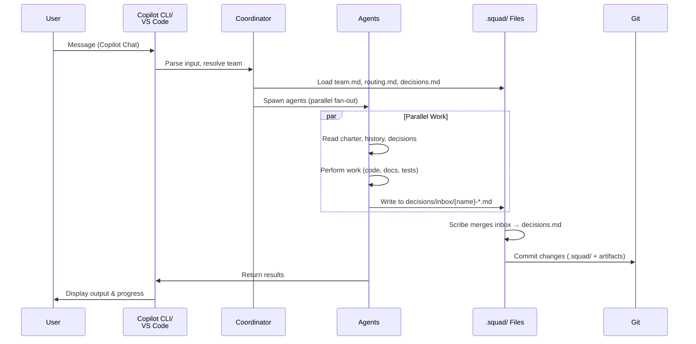
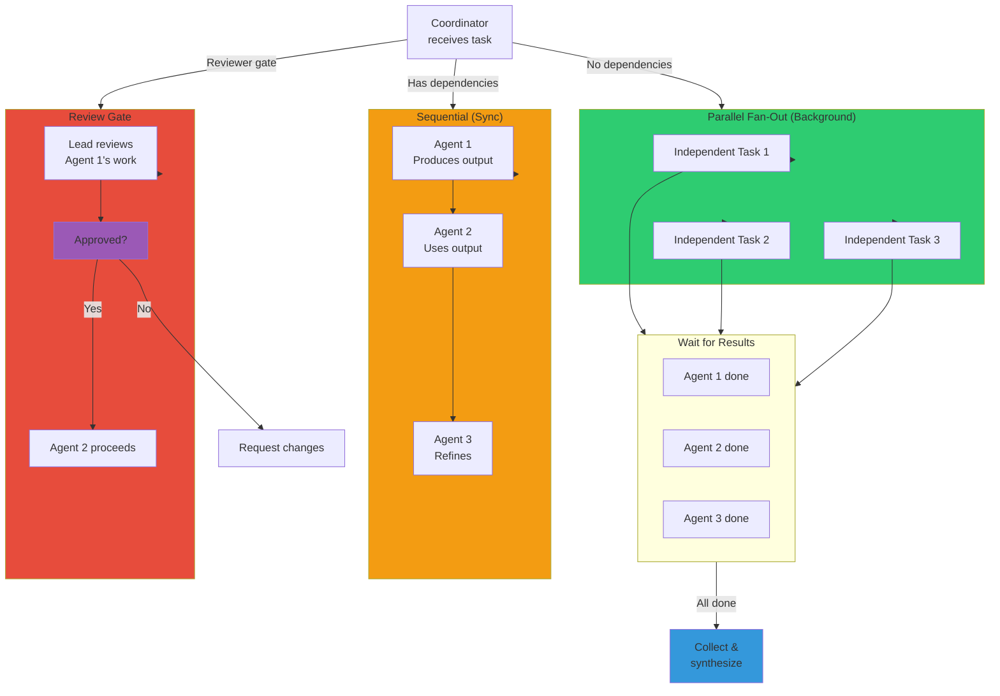
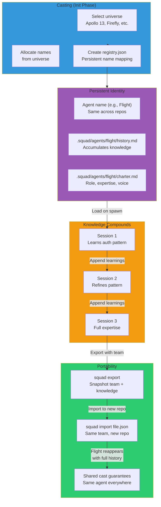
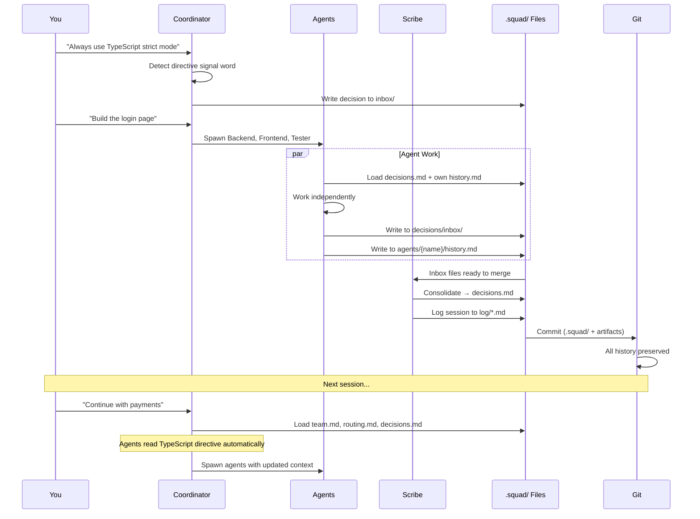

# Architecture

> ⚠️ **Experimental** — Squad is alpha software. APIs, commands, and behavior may change between releases.

Squad is a programmable multi-agent orchestration runtime for GitHub Copilot. Learn how agents spawn, coordinate, and persist knowledge across sessions.

---

## Try This

```
What happens when I type a message to Squad?
```

```
How do agents communicate with each other?
```

```
Where does my team's memory live?
```

---

## User Interaction Flow

When you send a message to Squad, the coordinator reads your team's context and launches agents in parallel. Here's the journey:



**What happens at each step:**

1. **User sends message** — via Copilot Chat or CLI (`copilot --agent squad` or `squad` shell)
2. **Coordinator resolves team** — reads `.squad/team.md` to find agents, routes work based on `routing.md`
3. **Agents spawn** — each agent loads its charter, history, and shared decisions
4. **Parallel execution** — agents work independently; those with dependencies wait for upstream results
5. **Decisions captured** — agents write decisions to drop-box (`decisions/inbox/`) for deduplication
6. **Scribe merges** — `decisions.md` updates automatically; session logged to `.squad/log/`
7. **Git persists** — all changes committed so knowledge compounds across sessions

---

## Component Architecture

Squad layers multiple abstraction boundaries so each component has a single responsibility:

```mermaid
graph TB
    subgraph UI["🖥️ User Interfaces"]
        COPILOT["Copilot CLI<br/>copilot --agent squad"]
        VSCODE["VS Code Copilot Chat<br/>Select Squad agent"]
        SHELL["Interactive Shell<br/>squad"]
    end
    
    subgraph ORK["🔄 Orchestration"]
        COORD["Coordinator<br/>Routes, launches, schedules"]
        ROUTE["Routing Logic<br/>team.md + routing.md"]
        MODEL["Model Selection<br/>Task → right tier"]
    end
    
    subgraph RUN["🏃 Execution"]
        SPAWN["Agent Spawning<br/>task tool (background/sync)"]
        AGENTS["Agents (Parallel)<br/>Read charter + history"]
        GATE["Review Gates<br/>Lead approval when needed"]
    end
    
    subgraph STATE[".squad/ State Files"]
        TEAM["team.md<br/>Roster + roles"]
        DECISIONS["decisions.md<br/>Shared rules"]
        HISTORY["agents/{name}/history.md<br/>Personal memory"]
        SKILLS["skills/{name}/SKILL.md<br/>Reusable patterns"]
        CASTING["casting/<br/>Persistent names"]
        INBOX["decisions/inbox/"]
    end
    
    subgraph PERSIST["💾 Persistence"]
        STORAGE["StorageProvider<br/>Abstract file I/O"]
        GIT["Git Repository<br/>Append-only logs"]
    end
    
    subgraph ART["📦 Artifacts"]
        CODE["Code"]
        DOCS["Docs"]
        TESTS["Tests"]
        CONFIG["Config"]
    end
    
    UI -->|Message| COORD
    COORD -->|Read context| ROUTE
    ROUTE -->|Analyze task| MODEL
    MODEL -->|Spawn agent| SPAWN
    SPAWN -->|Run in parallel| AGENTS
    AGENTS -->|Read knowledge| STATE
    AGENTS -->|Write decisions| INBOX
    INBOX -->|Merge| DECISIONS
    AGENTS -->|Produce| ART
    AGENTS -->|Learn| HISTORY
    
    STATE -->|Persist| STORAGE
    STORAGE -->|Commit| GIT
    GATE -.->|Reviewer checks| AGENTS
    
    style UI fill:#4A9EFF
    style ORK fill:#2ecc71
    style RUN fill:#f39c12
    style STATE fill:#9b59b6
    style PERSIST fill:#34495e
    style ART fill:#e74c3c
```



**Layer breakdown:**

- **UI Layer** — Entry points (Copilot CLI, VS Code, shell). All feed into the Coordinator.
- **Orchestration** — Coordinator reads routing rules, analyzes dependencies, selects models, schedules work.
- **Execution** — Agents spawn (via `task` tool) in parallel or sequential mode depending on dependencies.
- **State** — `.squad/` is the source of truth. Team roster, decisions, and personal memory live here.
- **Persistence** — StorageProvider abstracts file I/O; Git is the transport (all `.squad/` changes committed).
- **Artifacts** — Code, docs, tests, configs produced by agents. Usually committed alongside `.squad/` updates.

---

## State Management

Squad uses a drop-box pattern to avoid write conflicts when multiple agents work in parallel. Here's how knowledge flows:

```mermaid
graph TB
    subgraph AGENTS["🤖 Agents Working in Parallel"]
        A1["Agent 1<br/>Learns pattern"]
        A2["Agent 2<br/>Discovers convention"]
        A3["Agent 3<br/>Updates config"]
    end
    
    subgraph DROPBOX[".squad/decisions/inbox/<br/>Drop-box (conflict-free writes)"]
        D1["agent1-pattern.md"]
        D2["agent2-convention.md"]
        D3["agent3-config.md"]
    end
    
    subgraph SCRIBE["📋 Scribe Agent"]
        MERGE["Merge inbox<br/>→ decisions.md<br/>Deduplicate & link"]
    end
    
    subgraph SHARED[".squad/ Shared Brain"]
        DECISIONS["decisions.md<br/>All agents read before working"]
        HISTORY["agents/{name}/history.md<br/>Only {name} reads own"]
        SKILLS["skills/{name}/SKILL.md<br/>All agents read"]
    end
    
    subgraph LOG["📖 Audit Trail"]
        ORCHESTRATION[".squad/orchestration-log/*.md<br/>Who spawned, why, what happened"]
        SESSION[".squad/log/*.md<br/>Full session transcript"]
    end
    
    subgraph GIT["🔗 Git (Persistence)"]
        COMMIT["Commit to main/dev<br/>All changes versioned"]
    end
    
    A1 -->|Write| D1
    A2 -->|Write| D2
    A3 -->|Write| D3
    
    D1 & D2 & D3 -->|Batch merge| MERGE
    MERGE -->|Consolidate| DECISIONS
    
    DECISIONS -->|Load before work| A1 & A2 & A3
    HISTORY -->|Personal context| A1 & A2 & A3
    SKILLS -->|Reusable patterns| A1 & A2 & A3
    
    A1 & A2 & A3 -->|Session activity| ORCHESTRATION
    MERGE -->|Session summary| SESSION
    
    DECISIONS & HISTORY & SKILLS & ORCHESTRATION & SESSION -->|All committed| GIT
    
    style AGENTS fill:#f39c12
    style DROPBOX fill:#e67e22
    style SCRIBE fill:#3498db
    style SHARED fill:#9b59b6
    style LOG fill:#2c3e50
    style GIT fill:#27ae60
```



**How it works:**

1. **Agents write in parallel** — each writes to its own file in `.squad/decisions/inbox/` (no conflicts).
2. **Scribe merges** — periodically consolidates inbox files into `.squad/decisions.md`, deduplicating overlaps.
3. **Shared brain loads** — on every agent spawn, the Coordinator loads:
   - `decisions.md` (shared rules, all agents read)
   - `agents/{name}/history.md` (personal memory, only that agent reads)
   - `skills/` (reusable patterns, all agents read)
4. **Personal history grows** — after each session, agents append what they learned to their `history.md`.
5. **Git persists** — everything in `.squad/` is append-only and committed, so knowledge compounds.

---

## Parallel Execution Model

Squad's default is **eager parallelism** — launch everything that can run immediately:



**Execution modes:**

- **Background (fan-out)** — All independent agents run in parallel. Coordinator waits for all to finish, then collects results.
- **Sync (sequential)** — One agent waits for another's output. Used when there's a data dependency.
- **Review gates** — Lead agent reviews work before proceeding. Only approved work moves forward.
- **Concurrency limits** — Default is 5 agents in parallel; adjustable per session.

---

## Git Worktree Lifecycle

When worktree mode is enabled, Squad creates a dedicated git worktree for each issue. This isolates branch work, avoids disrupting the main checkout, and allows multiple agents to collaborate safely on the same issue. Here's the complete lifecycle:

```mermaid
graph TB
    subgraph TRIGGER["🎯 Trigger"]
        ISSUE["Issue assigned<br/>label: squad:agent<br/>e.g., #42"]
    end
    
    subgraph SETUP["🏗️ Worktree Setup"]
        CHECK["Check worktree mode<br/>squad.config.ts"]
        LIST["Check existing<br/>git worktree list"]
        EXISTS{Worktree<br/>exists?}
        CREATE["Create worktree<br/>git worktree add ../squad-42<br/>-b squad/42-fix-login main"]
        REUSE["Reuse existing<br/>worktree"]
        LINK["Link node_modules<br/>ln -s ../squad/node_modules"]
    end
    
    subgraph WORK["👥 Agent Work (Parallel)"]
        AGENT1["Agent 1<br/>reads charter + history"]
        AGENT2["Agent 2<br/>shares same worktree"]
        SHARED[".squad/ state<br/>worktree-local<br/>separate per branch"]
    end
    
    subgraph COMMIT["📝 Commit & Push"]
        MODIFY["Modify files<br/>in worktree"]
        COMMIT_MSG["git commit<br/>message with Co-authored trailer"]
        PUSH["git push origin squad/42-fix-login"]
    end
    
    subgraph PR["🔀 PR Flow"]
        CREATE_PR["gh pr create<br/>--base dev"]
        REVIEW["PR reviewed<br/>agents + humans"]
        MERGE["Merge PR<br/>to dev/main"]
    end
    
    subgraph MERGE_STATE["🔗 State Merge"]
        MERGE_DECISION["Merge .squad/ via<br/>merge=union driver<br/>(append-only)"]
        DECISIONS_COMBINED["decisions.md +<br/>history.md combined"]
    end
    
    subgraph CLEANUP["🧹 Cleanup"]
        REMOVE_WT["git worktree remove<br/>{worktree_path}"]
        DELETE_BRANCH["git branch -d<br/>squad/42-fix-login"]
    end
    
    subgraph STRATEGY["Strategy Comparison"]
        LOCAL["worktree-local<br/>(Recommended)<br/>Each branch has own<br/>.squad/ state<br/>Merges via git"]
        MAIN["main-checkout<br/>All worktrees share<br/>main repo's .squad/<br/>Simpler but<br/>NOT concurrent-safe"]
    end
    
    TRIGGER --> CHECK
    CHECK --> LIST
    LIST --> EXISTS
    EXISTS -->|Yes| REUSE
    EXISTS -->|No| CREATE
    REUSE & CREATE --> LINK
    LINK --> AGENT1 & AGENT2
    AGENT1 & AGENT2 --> SHARED
    SHARED --> MODIFY
    MODIFY --> COMMIT_MSG
    COMMIT_MSG --> PUSH
    PUSH --> CREATE_PR
    CREATE_PR --> REVIEW
    REVIEW --> MERGE
    MERGE --> MERGE_DECISION
    MERGE_DECISION --> DECISIONS_COMBINED
    DECISIONS_COMBINED --> REMOVE_WT
    REMOVE_WT --> DELETE_BRANCH
    
    DELETE_BRANCH -.-> STRATEGY
    
    style TRIGGER fill:#3498db
    style SETUP fill:#2ecc71
    style WORK fill:#f39c12
    style COMMIT fill:#9b59b6
    style PR fill:#e74c3c
    style MERGE_STATE fill:#1abc9c
    style CLEANUP fill:#e67e22
    style STRATEGY fill:#34495e
```



**Worktree-local vs main-checkout strategy:**

- **Worktree-local** (recommended) — Each worktree gets its own `.squad/` branch-local state. When the PR merges, the `merge=union` driver combines decisions and histories from all branches automatically. Safe for concurrent multi-agent sessions.
- **Main-checkout** — All worktrees share the main repo's `.squad/` state on disk. Changes are immediately visible but **not safe for concurrent work**—use only with one active session at a time.

**Key steps:**

1. **Check worktree mode** — Look for `worktrees: true` in config or `SQUAD_WORKTREES` env var.
2. **Reuse if exists** — Before creating, run `git worktree list` to check if worktree for this issue already exists.
3. **Create branch** — `git worktree add {path} -b squad/{issue}-{slug} {base_branch}`.
4. **Link dependencies** — Symlink `node_modules` from main repo to save build time.
5. **Multiple agents** — 2+ agents can safely work in the same worktree for the same issue.
6. **Merge state** — `.squad/` files merge via `merge=union` driver (append-only, no conflicts).
7. **Cleanup** — After PR merge, remove worktree and delete branch.

---

## Casting & Persistent Naming

Agents have permanent names from a thematic universe (e.g., Apollo 13 / NASA Mission Control). Names persist across sessions and repos:



**Why persistent names matter:**

- **Identity** — Each agent (e.g., "Flight", "Procedures") is known by one name forever.
- **Knowledge** — Flight builds up history in `.squad/agents/flight/history.md` across sessions.
- **Portability** — Export a team, import it to a new repo, and Flight is there with all their knowledge.
- **Casting** — Names come from a thematic universe so your team feels cohesive (not random labels like "Agent1").

---

## Decision & Knowledge Flow

Here's the complete loop of how decisions and knowledge move through the system:



**Knowledge persistence:**

1. **Directives captured** — When you say "always…" or "never…", the Coordinator writes to `decisions.md`.
2. **Decisions merged** — Scribe consolidates inbox files into shared `decisions.md` automatically.
3. **Personal memory grows** — Agents append learnings to their `history.md` after each session.
4. **Session logged** — Full orchestration and session logs written to `.squad/log/` (append-only).
5. **Git commits all** — Every change persists to Git, so knowledge compounds and is never lost.

---

## Tips

- **Parallel by default** — Squad launches agents eagerly. Only switch to sequential if you have explicit dependencies or need to control costs.
- **Drop-box pattern** — Multiple agents can write decisions in parallel because each writes to a separate file in `decisions/inbox/`.
- **Memory compounds** — The more sessions you run, the smarter agents become. First session is always the least capable.
- **Commit `.squad/`** — Anyone who clones the repo gets the team with all their knowledge intact.
- **Portable teams** — Use `squad export` and `squad import` to move trained teams to new repositories.

---

## Learn more

- [Your Team](./your-team.md) — Understand roles, charter, and the reviewer protocol
- [Memory & Knowledge](./memory-and-knowledge.md) — How agents learn and persist knowledge
- [Parallel Work](./parallel-work.md) — Background vs. sync execution, model selection
- [Concepts](../) — Routing, casting, skills, and more
